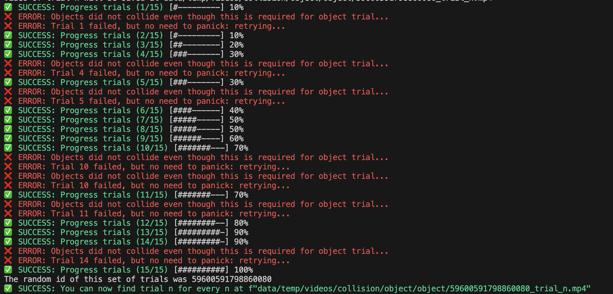

# TDW Trials
Implements automated generation of object, agent, and transition-based videos in TDW.
Note: An internet connection is needed.

## Object-based trials
- Collision trials: At least two objects collide.
- Permanence trials: Object rolls behind an occluder and then returns on the other side.
- Containment trials: Object is contained in a larger container object, and the container is shaken -> object might or might not fall out of the container.
- Rolling down a slope: Object might bounce/roll back up a bit.

## Transition trials
- Collision trials - Object avoids collision: "moves out of the way."
- Permanence trials: After an initial pause, the object "hides behind the occluder" or changes speed.
- Containment trials: The object starts jumping towards the container to increase the "shaking."
- Rolling down a slope: The object rolls back up the slope after a while.

## Agent trials
- Agent seeks collision/touch: Jumps over obstacles in a non-straight line to meet the target object.
- Permanence trials: The target object moves behind the occluder, and the agent follows.
- Containment trials: The agent is inside the container and waits for a couple of frames; afterwards, it will fly towards the target, often "melting" through the container.
- Rolling down a slope: The agent rolls up a slope to meet the red target object at the top.

Segmentation and other data are available by specifying pass masks; see: https://github.com/threedworld-mit/tdw/blob/master/Documentation/api/command_api.md#set_pass_masks

## Install and run tdw_trials
1. Create conda environment:
```
conda create --name tdw_trials python=3.11
conda activate tdw_trials
```

3. Install requirements:
```
pip install -r requirements.txt
```

4. Create trials for all
```
python multiple_runner.py --num 15 --pass_masks _img,_mask,_id,_depth_simple,_category
```

### Notes and debugging
You can also run each controller separately.
To fix the error ```zmq.error.ZMQError: Address already in use (addr='tcp://*:1071')``` at step 4, you can run ```pkill python``` and run step 4 again.
The results will be saves in ./data/temp/, the videos can be opened best with VLC.

### Parameters
There are many parameters; you can run ```python multiple_runner.py --help``` or ```python multiple_runner.py -h``` for help.

The parameters are saved in a CSV file, containing all the settings for each video. It also includes the object names (object_names) and the frame numbers containing agent or transition frame information (transition_frames). If there is a constant force, it will only contain a list with the one frame number on which this force was added. However, if the agent 'walks' by teleporting a small step every frame, it will contain a list of every frame number where the agent teleported. If the transition or agent did not obtain agency, it will contain the number -1.

## Copyright
A lot of this code is based on or an edited version of the code in the [tdw_physics](https://github.com/alters-mit/tdw_physics) repository, Copyright (c) 2021 Seth Alter.
However, many changes have been made, hence also use Copyright (c) 2023 Mees Meester | Meester Solutions.
This project follows the MIT License.

## Notes
- Not all the scenes are tested; trials are tested in an empty room, so objects might spawn in walls, etc., or empty frames might be observed.
- Occlusion trials do NOT work for rooms other than the empty room (yet).
- tdw_room gives a weird 'shine' with the windows.
- box_room_2018 might have too much friction for the current forces because of the carpet.
- Many colliding objects appear too bouncy when falling down.
- Some scales seem unrealistic.
- Different transitions:
  - Moving objects in occlusion already have a force; they are frozen before applying teleport movement.
  - Contained objects get tiny forces when the object is not shaky enough.
  - Rolling down objects get a teleport movement but are not first frozen.
  - Colliding objects get a teleport movement but are not first frozen.

### Automated cherry-picking
The controllers have some tests implemented, filtering, and redoing some failed trials. This creates a bias towards some easier random settings.

You can see how some failed trials are automatically redone in the output:


### Force of magnitude
The magnitude of the force should be significantly bigger for bigger and heavier objects. The mass of objects is (often or always) fixed, and overall the magnitude will be larger for larger objects. The chosen magnitude also depends on trial_types and the controller.
