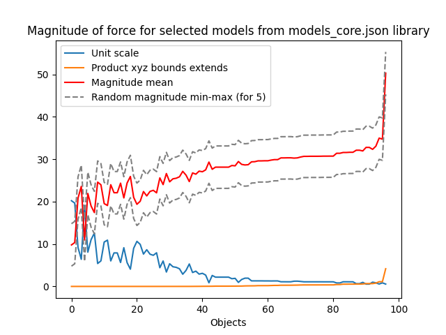

# TDW Trials
Implements automated generation of object, agent and transition based videos in TDW  
Note: internet connection needed

## Object based trials
- Collision trials (at least two objects collide)
- Permanence trials (object rolls behind occluder and then returns on other side)
- Containment trials (object is contained in larger container object and container is shaken -> object might or might not fall out of the container)
- Rolling down a slope

## Transition trials
- Object avoids collision ("moves out of the way")
- Permanence trials (after initial pause, object "hides behind occluder")
- Containment trials (object jumps out after a while "because it is too shaky")
- Rolling back up the slope after a while

## Agent trials
- agent seeks collision/touch (moves around obstacles in non-straight line to meet red target object)
- red target object moves behind occluder, agent follows after a while
- both red target object and agent are inside container, shaken. The agent tries to compensate for the shaking and seeks to touch the red target object. If the red target object leaves the container, so does the agent to follow.
- after initial pause, the agent rolls up a slope to meet the red target object at the top

Segmentation and other data available by specifying pass masks see: https://github.com/threedworld-mit/tdw/blob/master/Documentation/api/command_api.md#set_pass_masks

## Install and run tdw_trials
1. Create conda environment
```
conda create --name tdw_trials python=3.11
conda activate tdw_trials
```
3. Install requirements:
```pip install -r requirements.txt```
4. Download TDW.app
5. Run controller in controller folder
```
cd controllers
python <controller_name>.py
```
5. Might have to run again:
 ```python <controller_name>.py```
## Copyright
A lot of this code is based on, or an edited version of the code in the [tdw_physics](https://github.com/alters-mit/tdw_physics) repository, Copyright (c) 2021 Seth Alter
However, I put in many hours in to shape, so plese also consider, Copyright (c) 2023 Mees Meester

## Notes
- Not all the scenes are tested, trials are tested in empty room, so objects might spawn in walls etc. or empty frames mith be
 - Occlusion trials do NOT work for other rooms then empty room (yet)
  - tdw_room gives a weird 'shine' with the windows
  - box_room_2018 might have too much friction for the current forces because of the carpet
- Many colliding objects appear too bouncy when falling down
- Some scales seem unrealistic
- Different transitions:
 - Moving objects in occlusion already have a force, they are frozen before applying teleport movement
 - Contained objects get tiny forces when the object is not shaky enough
 - Rolling down objects get a teleport movement, but are not first frozen
 - Collding objects get a teleport movement, but are not first frozen

### Force of magnitude
The magnitude of the force should be significantly smalller for light/small objects then for heavy/large objects. 
We use the following code for any record:
```python
magnitude = (-TDWUtils.get_unit_scale(record)*2+55)/2 + (np.prod(TDWUtils.get_bounds_extents(record.bounds))*10+15)/2 - 5 + random.uniform(-randomness, randomness)
```
Contained objects uses 1/4 of this force magnitude.
If we assume a lower bound of -5 and an upper bound of 5 we get for:
+5: Lowest magnitude is 14.783988078744567 and highest is 55.30601623934612
middle: Lowest magnitude is 9.783988078744567 and highest is 50.30601623934612
-5: Lowest magnitude is 4.783988078744567 and highest is 45.30601623934612

The graph shows that with the current formula and a randomness setting of 5 we get an increasing magnitude when the product of the [external bounds](https://github.com/threedworld-mit/tdw/blob/master/Documentation/python/tdw_utils.md#get_bounds_extents) increased and the [scale factor](https://github.com/threedworld-mit/tdw/blob/master/Documentation/python/tdw_utils.md#get_unit_scale) decreased. 

NOTE: The __Magnitude of force for models core__ graph regards objects from the models_core.json libray, but only the 96 selected models for these trials.  


## TODO
- ~~Object based trials first version~~
- ~~Transition based trials first version~~
- Agent based trials first version
- Full second version
- Full final version
- Make multiple resets again within trial sets, because current version is messy and doesn't work with background objects
- ~~Streamline platform~~
- ~~Chose better objects~~
- ~~Make a objectshower or use the TDW objectshower~~
- ~~Implement rolling down controller~~
- ~~Improve occlusion: don't stop behind object, but behind object in line with camera angle~~
- ~~Improve occlusion: in objectbased, use force~~
- ~~Use real ___masses___ for occluding (not masses, but bounds and scale, see Force of magnitude)~~
- ~~Get real height and width of objects~~
